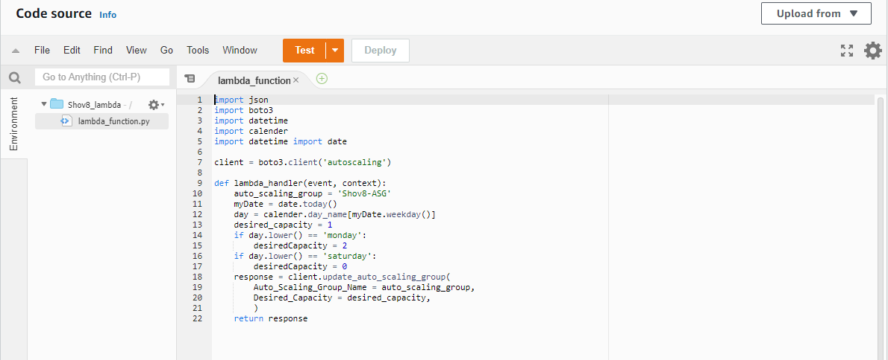

### AWS Assignment - 2 

## Output windows showing timestamp when flask app is ran.

## Steps are as follows:

1. Create a VPC only and  use a CIDR. Enable DNS hostname in settings.

2. Create an internet gateway and attach it to your VPC.

3. Create 2 public subnets and 2 private subnets.

4. As you create VPC and subnets by default a route table is created but you need to create one more route table (for public & private subnets separate)

Route table for public subnets will have a interent gateway connection where as private don't.

5. Create subnet group for private subnet.

6. Create a RDS with mysql with public accessibility-no, having the same VPC as created above and with the private subnet group.

7. Now create a EC2 instance using Ubuntu AMI having the same VPC and one public subnet.

8. Add port 22,24,80,3306 and 5000 in security group of EC2 instance.

9. Copy the private IPv4 address from EC2 instance and paste it in RDS security group with port 3306.

Add CIDR of public subnet in the inbound security groups of RDS.

10. Connect with your EC2 instance.

11. Connect with mysql client. Before that install mysql using following command.

sudo apt install mysql-server

--> Use following commands to connect with your database and create a table in it.

-->Further you need to install flask, python3, pip3, awscli,nginx, gunicorn3 for your EC2 instance.

-->Setup nginx and gunicorn3 for deployment of your flaskapp.

-->After deployment of your flask app

-->Output windows showing timestamp when flask app is ran.

12. Create a template from your EC2 instance. 

13. Create target group. 

14. Create an autoscaling group using your VPC.

15. Create the lambda function.

